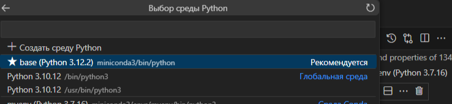

# Oil-code

install conda 

```bash
mkdir -p ~/miniconda3
wget https://repo.anaconda.com/miniconda/Miniconda3-latest-Linux-x86_64.sh -O ~/miniconda3/miniconda.sh
bash ~/miniconda3/miniconda.sh -b -u -p ~/miniconda3
rm -rf ~/miniconda3/miniconda.sh
~/miniconda3/bin/conda init bash
~/miniconda3/bin/conda init zsh
```
restart shell

create venv in conda

```bash
conda create -n myenv python=3.7
conda activate myenv
conda install jupyter
conda install ipykernel
python -m ipykernel install --user --name=myenv
```

Выбрать среду выполнения в ноутбуке 

