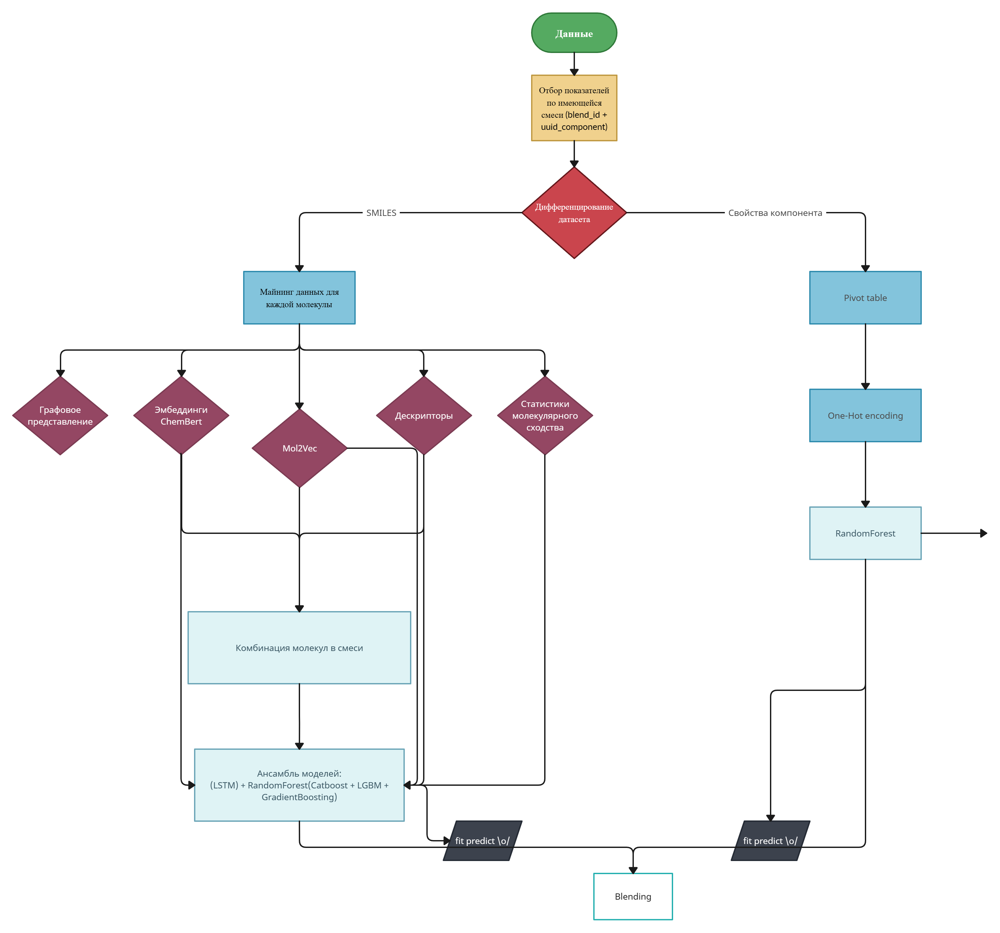

# Oil-code

_______________________________________________________________________

## Настройки среды выполнения

install conda 

```bash
mkdir -p ~/miniconda3
wget https://repo.anaconda.com/miniconda/Miniconda3-latest-Linux-x86_64.sh -O ~/miniconda3/miniconda.sh
bash ~/miniconda3/miniconda.sh -b -u -p ~/miniconda3
rm -rf ~/miniconda3/miniconda.sh
~/miniconda3/bin/conda init bash
~/miniconda3/bin/conda init zsh
```
restart shell

create venv in conda

```bash
conda create -n myenv python=3.7
conda activate myenv
conda install jupyter
conda install ipykernel
python -m ipykernel install --user --name=myenv
```

Выбрать среду выполнения в ноутбуке 

## Постановка задачи

Подробности задания доступны в файле [Задача Нефтекод.pdf](<src/materials/Задача Нефтекод2024.pdf>). 

Данные представлены в виде записей о составе компонентов различных масел.

| oil_type                               | blend_id                               | oil_property_param_title              | oil_property_param_value | component_name                            | component_class    | polymer | component_property_param_title        | component_property_param_value | smiles |
|----------------------------------------|----------------------------------------|---------------------------------------|--------------------------|-------------------------------------------|---------------------|---------|---------------------------------------|----------------------------------|--------|
| 3fa07e0a-415c-496d-b88b-557855cb3e77   | 49743a76-a614-11ee-9529-005056921581   | 4c7a51f1-dc82-41dc-92fa-772535c2c70c | 15.58                    | 615537f6-1f8f-4240-a5e9-8f7be344ecd3      | базовое масло 1 гр | no      | 02236ee6-5eec-4368-a2e4-6f2e73fb0f96  | 0.0                              | CCCCC  |
| 3fa07e0a-415c-496d-b88b-557855cb3e77   | 49743a76-a614-11ee-9529-005056921581   | 4c7a51f1-dc82-41dc-92fa-772535c2c70c | 15.58                    | 615537f6-1f8f-4240-a5e9-8f7be344ecd3      | базовое масло 1 гр | no      | 2511714c-ab50-4566-bc92-8e4095d87d01  | 0.0                              | CCCCC  |
| 3fa07e0a-415c-496d-b88b-557855cb3e77   | 49743a76-a614-11ee-9529-005056921581   | 4c7a51f1-dc82-41dc-92fa-772535c2c70c | 15.58                    | 615537f6-1f8f-4240-a5e9-8f7be344ecd3      | базовое масло 1 гр | no      | 38b06d9a-bcf2-40de-8e1b-9c3988c42406  | 0.0001                           | CCCCC  |
| 3fa07e0a-415c-496d-b88b-557855cb3e77   | 49743a76-a614-11ee-9529-005056921581   | 4c7a51f1-dc82-41dc-92fa-772535c2c70c | 15.58                    | 615537f6-1f8f-4240-a5e9-8f7be344ecd3      | базовое масло 1 гр | no      | f216a0c7-d453-4b15-9b4a-7647cbe2d874  | 0.099                            | CCCCC  |
| 3fa07e0a-415c-496d-b88b-557855cb3e77   | 49743a76-a614-11ee-9529-005056921581   | 4c7a51f1-dc82-41dc-92fa-772535c2c70c | 15.58                    | 615537f6-1f8f-4240-a5e9-8f7be344ecd3      | базовое масло 1 гр | no      | 9703e283-f529-4fdb-8d84-24413b2b4338  | 0.0001                           | CCCCC  |
| 3fa07e0a-415c-496d-b88b-557855cb3e77   | 49743a76-a614-11ee-9529-005056921581   | 4c7a51f1-dc82-41dc-92fa-772535c2c70c | 15.58                    | 615537f6-1f8f-4240-a5e9-8f7be344ecd3      | базовое масло 1 гр | no      | a59e9688-c5e5-4488-a911-2fc21e0355be  | 0.0002                           | CCCCC  |

Необходимо предсказать `oil_property_param_value` определенного компонента.

## Подход к решению задачи

Поскольку в задаче необходимо было предсказывать данные как на компонентах смеси, так и на smiles представлениях молекул смеси, то мы построили 2 дифференцированных пайплайна: на компонентах и на smiles.



В итоге получили хорошие метрики на тесте (*MAE 17877,583*) и устойчивый пайплайн, способный справляться с выбросами. Подробности можно посмотреть в [тренировочный ноутбук](src/train_on_SMILES_seq.ipynb) а основной код в [utils.py](src/utils.py).

